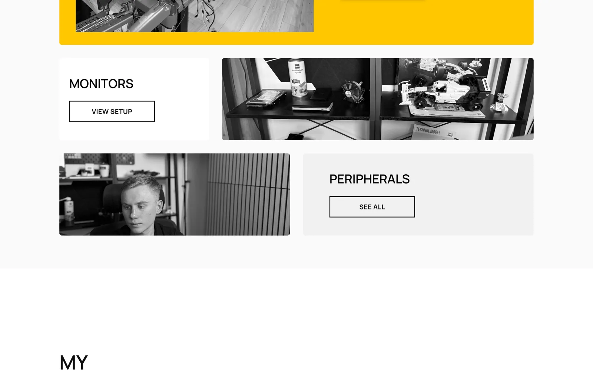

# WorkStation-Vue-TypeScript

> 🚀 **Interactive Gaming & Work Setup Showcase with Vue 3 + TypeScript** - Present a complete hardware workspace as a fast, SEO-ready single-page application

**WorkStation** is an interactive portfolio for visualizing a complete gaming and productivity workspace. Built with Vue 3, TypeScript and Vite, it breaks a real setup down into six hardware categories — PC, laptop, monitors, peripherals, audio and workspace — each with its own category page, per-component detail page, photo gallery and full technical specifications.

The repository demonstrates a typed data-driven architecture: every component of the setup is described once in `src/data/WorkStation-data.ts` and rendered through generated routes, with per-route SEO metadata managed by Unhead, styling handled by Tailwind CSS, and end-to-end coverage provided by Cypress.


---

## 🎯 Key Features

- 🖥️ **Full Setup Showcase** — Landing page, complete setup overview, an all-components view and a full specifications page
- 🗂️ **Six Hardware Categories** — PC, laptop, monitors, peripherals, audio and workspace, each with a generated category route and component route
- 📋 **Detailed Specifications** — Every component carries a typed spec list, description, main image and a detail image gallery, all defined in a single data file
- 🛣️ **Programmatic Routing** — Category and component routes are generated by `categoryRoute()` / `componentRoute()` helpers instead of being hand-written
- 🔍 **Per-Route SEO** — Unhead's `useSeoMeta` sets title, description and Open Graph tags for every route, including a dedicated 404 page
- ⚡ **Lazy-Loaded Pages** — All pages except the landing page are dynamically imported for smaller initial bundles
- 🎨 **Tailwind-Based UI** — Utility-first styling with PostCSS, Autoprefixer and `prettier-plugin-tailwindcss` for consistent class ordering
- 🖼️ **WebP Image Pipeline** — `convert-images.js` (sharp) and `convert-heic.sh` convert product photography under `public/products/` to WebP
- 🧪 **Cypress E2E Tests** — End-to-end specs for navigation and the components view, plus a configured component-testing runner
- 🧭 **Scroll Restoration** — Router-level `scrollBehavior` restores saved positions on back-navigation
- 🤖 **CI/CD** — GitHub Actions workflow (`.github/workflows/deploy.yml`) with `gh-pages` deployment support

---

## 🖼️ Screenshots

| Landing Page | Setup Overview |
|---|---|
|  |  |

---

## 🧩 Hardware Categories

| Category | Route | Contents |
|---|---|---|
| **PC** | `/pc` | Gaming desktop — Ryzen 7 5800X + RX 9070xt |
| **Laptop** | `/laptop` | MacBook Pro mobile workstation |
| **Monitors** | `/monitors` | IIYAMA G-MASTER GB2530HSU (x2), HP 25x |
| **Peripherals** | `/peripherals` | Razer BlackWidow Pro V4, Razer Viper V2 Pro, Logitech MX3, Razer BlackShark V2 Pro, mouse bungee, Epson L3560 |
| **Audio** | `/audio` | EDIFIER R1855DB 2.0, HyperX QuadCast S, Panasonic Lumix G7, DJI Action 4 |
| **Workspace** | `/workspace` | Custom oak-top desk, ergonomic office chair |

Each category also exposes a per-component detail route, and the aggregated views live at `/setup`, `/components` and `/specs`.

---

## 🛠️ Technology Stack

### Frontend

- **Vue 3.3** — Progressive framework with the Composition API and SFCs
- **TypeScript 5.0** — Static typing across data, routes and utilities
- **Vue Router 4.2** — Client-side routing with `createWebHistory` and scroll restoration
- **Pinia 2.1** — Store instance registered in `src/main.ts`, ready for state management
- **@unhead/vue 1.7** — Document head and SEO metadata management
- **@vueuse/core 10.4** — Composition utilities
- **Tailwind CSS 3.3** — Utility-first styling with PostCSS and Autoprefixer

### Build & Tooling

- **Vite 4.4** — Dev server and production bundler
- **vue-tsc 1.8** — Type checking as part of the build
- **ESLint 8 + Prettier 3** — Linting and formatting (`eslint-plugin-vue`, `@typescript-eslint`, `prettier-plugin-tailwindcss`)
- **sharp 0.34** — Image conversion used by `convert-images.js`

### Testing

- **Cypress 13.1** — E2E tests against `http://localhost:5173`, plus a Vue/Vite component-testing runner
- **@pinia/testing 0.1** — Pinia store testing helpers

### Infrastructure

- **GitHub Actions** — Automated build/deploy workflow
- **gh-pages 6.3** — Publishes the `dist/` folder to GitHub Pages
- **Custom domain** — Configured through the `CNAME` file

---

## 🚀 Getting Started

### Prerequisites

- **Node.js** (version 16.0 or higher)
- **npm** or **yarn** package manager
- **Git** for version control
- A modern web browser (Chrome, Firefox, Safari, Edge)

### 1. Clone the Repository

```bash
git clone https://github.com/dawidolko/WorkStation-Vue-TypeScript.git
cd WorkStation-Vue-TypeScript
```

### 2. Install Dependencies

```bash
npm install
```

### 3. Run

```bash
npm run dev
```

The application is served at [http://localhost:5173](http://localhost:5173).

Alternatively, use the bundled helper scripts, which check for Node.js and npm, install dependencies when `node_modules/` is missing, and then start the dev server:

```bash
./start.sh     # Linux / macOS
start.bat      # Windows
```

### Available Scripts

| Command | Description |
|---------|-------------|
| `npm run dev` | Start the Vite development server on port 5173 |
| `npm run build` | Type-check with `vue-tsc` and build to `dist/` |
| `npm run preview` | Serve the production build locally |
| `npm run deploy` | Build and publish `dist/` to GitHub Pages via `gh-pages` |

### Running E2E Tests

Cypress is configured with `baseUrl: http://localhost:5173`, so start the dev server first, then open or run the suite:

```bash
npm run dev            # in one terminal
npx cypress open       # interactive runner
npx cypress run        # headless run
```

Specs live in `cypress/e2e/` — `navbar.cy.ts` covers global navigation and `components.cy.ts` covers the components view.

### Optimizing Images

```bash
node convert-images.js   # convert public/products/ images to WebP via sharp
./convert-heic.sh        # convert HEIC source photos
```

---

## 📁 Project Structure

```
WorkStation-Vue-TypeScript/
├── 📁 cypress/
│   ├── 🧪 e2e/                     # E2E specs (navbar.cy.ts, components.cy.ts)
│   ├── 📦 fixtures/                # Test fixtures
│   └── 🛠️ support/                 # Commands and component-testing setup
├── 📁 docs/
│   └── 🖼️ screenshots/             # README preview images
├── 📁 public/                      # Static assets, product photography, CNAME
├── 📁 src/
│   ├── ⚛️ components/              # Reusable Vue components
│   │   ├── 🔘 Buttons/             # button-solid, button-empty, button-count, button-go-back
│   │   ├── 🗃️ Category-Box/        # Category box and container
│   │   ├── 🧭 navigation-global.vue
│   │   ├── 🦶 footer-global.vue
│   │   ├── ℹ️ info-section.vue
│   │   └── 🔗 ymal-boxes.vue
│   ├── 📊 data/                    # Typed data layer
│   │   ├── ⚙️ WorkStation-data.ts  # Hardware definitions for all six categories
│   │   ├── 🛠️ WorkStation-utils.ts # Data lookup helpers
│   │   ├── 🏷️ component-types.ts   # TypeScript interfaces
│   │   └── 🔍 meta.ts / meta-types.ts / meta-utils.ts  # SEO metadata
│   ├── 📄 pages/                   # Landing, Setup, Components, Category, Product, Specs, 404
│   ├── 🛣️ routes/                  # routes.ts + route-utils.ts (route generators)
│   ├── 🎨 assets/                  # Static assets
│   ├── 🎨 style.css                # Tailwind entry point
│   ├── 🧩 App.vue                  # Root component
│   └── 💻 main.ts                  # Application entry point
├── 🖥️ start.sh / start.bat         # Cross-platform setup + dev-server scripts
├── 🖼️ convert-images.js            # WebP conversion via sharp
├── 🖼️ convert-heic.sh              # HEIC conversion helper
├── ⚡ vite.config.ts               # Vite configuration
├── 🧪 cypress.config.ts            # Cypress configuration
├── 🎨 tailwind.config.js           # Tailwind configuration
├── 📦 package.json                 # Dependencies and scripts
└── 📖 README.md                    # Project documentation
```

---

## 🌍 Live Demo

The project is deployed and available at: **[https://workstation.dawidolko.pl](https://workstation.dawidolko.pl)**

---

## 📄 License

This project is open source and available under the [MIT License](LICENSE).

---

## 👨‍💻 Author

Created by **[Dawid Olko](https://github.com/dawidolko)**

- **Website** — [dawidolko.pl](https://dawidolko.pl/)
- **LinkedIn** — [@dawidolko](https://www.linkedin.com/in/dawidolko/)
